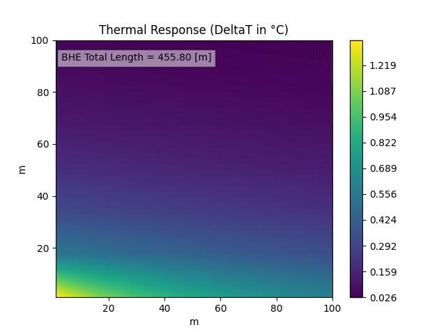

<!DOCTYPE html>
<html>

<head>
  <meta charset="utf-8">
  <meta name="viewport" content="width=device-width, initial-scale=1.0">
  <link rel="stylesheet" href="https://stackedit.io/style.css" />
</head>

<body class="stackedit">
  
<h1 id="gshp---calculation-of-the-borehole-heat-exchanger-total-length">GSHP - CALCULATION OF THE BOREHOLE HEAT EXCHANGER TOTAL LENGTH</h1>
<h2 id="overview">Overview</h2>

Ground Source Heat Pumps (GSHPs), also known as geothermal heat pumps, offer an efficient and eco-friendly solution for heating and cooling buildings. Utilizing the consistent temperature of the ground, they transfer heat between the ground and the building. This project focuses on developing an algorithm to calculate the total length of borehole heat exchangers based on building design heat load and ground thermal properties. Additionally, it assesses the field response of the borehole heat exchanger after 10 years.

<h2 id="project-details">Project Details</h2>

This project incorporates the ASHRAE Tp8 methodology to facilitate the evaluation of the necessary length of borehole heat exchangers. It’s designed to aid users in accurately determining the optimal exchanger length required for their specific applications. A key feature of this project is the development of a sophisticated algorithm that calculates the total length of borehole heat exchangers. 
This calculation is based on two critical factors: the building’s design heat load and the thermal properties of the ground. This approach ensures a tailored and efficient design for each unique setting. 
An additional capability of this tool is its long-term performance assessment. Users can evaluate the field response of the borehole heat exchanger over an extended period, up to 10 years. This feature provides valuable insights into the longevity and effectiveness of the heat exchanger installation. 
To assist users in utilizing this tool, default values are provided. These values serve as a guide, helping users understand the input requirements and make informed decisions about their specific configurations.

For a comprehensive overview,  please visit the project’s dedicated webpage:

🔗 <a href="https://serhanyuzbey.com/project_3">GSHP-Ashrae Tp8 Analysis</a>

<h2 id="features">Features</h2>
<ul>
<li><strong>Algorithm for Length Calculation</strong>: Determines the total length of borehole heat exchangers.</li>
<li><strong>Evaluation of Heat Pump Performance</strong>: Analyzes COP in both heating and cooling modes.</li>
<li><strong>Long-Term Impact Assessment</strong>: Evaluates the borehole field response over a decade.</li>
</ul>
<h2 id="how-to-use">How to Use</h2>

This tool allows users to input various parameters related to their site, heat pump, ground properties, and borehole configuration. Users can input monthly design heat load values, COP in different modes, thermal properties of the ground, and specifics of the borehole and heat exchanger design. Default values are provided for guidance.

<h2 id="results-and-interpretation">Results and Interpretation</h2>

This project is designed with user experience in mind, featuring pre-set default values that facilitate the assessment of the required total borehole heat exchanger length. These defaults provide a quick start option for users, simplifying the initial setup and enabling an efficient evaluation process. 
A key feature of this tool is its ability to visualize results through a plotted chart. This chart not only displays the calculated value of the heat exchanger length but also allows users to observe the temperature difference around the heat exchanger field over a specified number of years. This visual representation aids in better understanding and interpreting the long-term performance and impact of the heat exchanger system. 

<h2 id="contact">Contact</h2>

Should you have any questions or suggestions about the project, feel free to reach out to me:

<ul>
<li>Email: <a href="mailto:serhanyuzbey@gmail.com">serhanyuzbey@gmail.com</a></li>
<li>Social Media: <a href="www.linkedin.com/in/serhanyuzbey">LinkedIn</a></li>
</ul>
<h2 id="acknowledgements">Acknowledgements</h2>

I would like to thank my advisors, peers, and all who supported me throughout this project.

</body>

</html>
